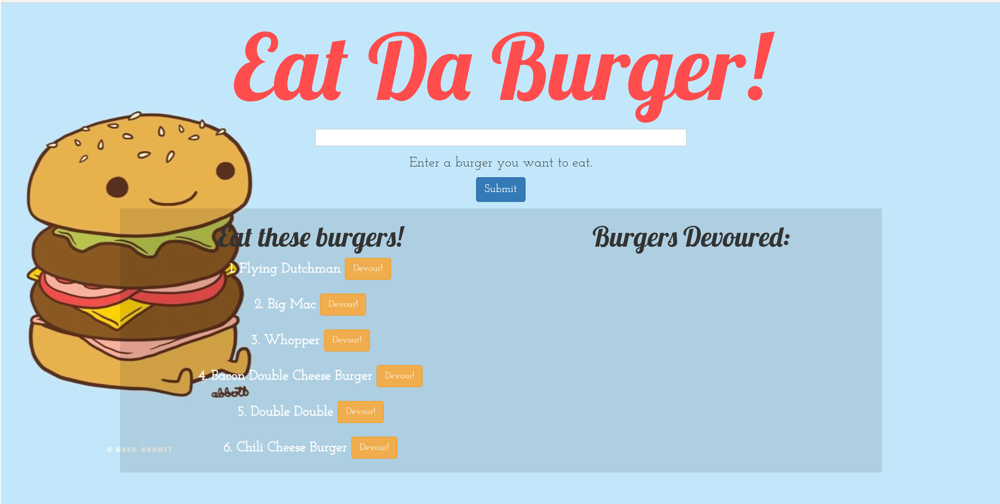

EatDaBurger is an MVC App That uses Node, Express, Handlebars, and MySQL. The app allows you to Add Burgers to a list which then allows you to Devour them.

Try the app https://burger5.herokuapp.com/index

